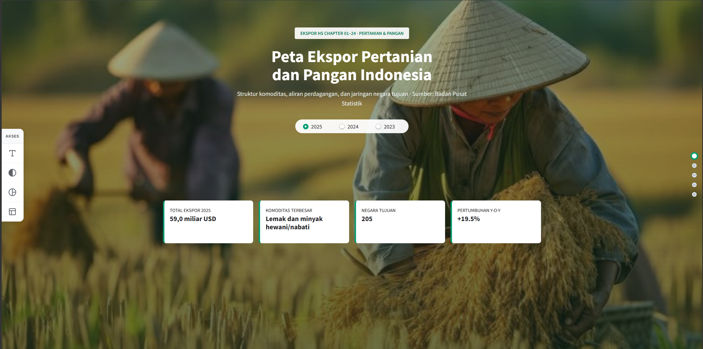

# Peta Ekspor Pertanian dan Pangan Indonesia

Dashboard interaktif yang memvisualisasikan data ekspor sektor pertanian dan pangan Indonesia. Aplikasi ini dibuat sebagai pemenuhan tugas Ujian Akhir Semester mata kuliah Visualisasi Data dan Informasi di Politeknik Statistika STIS tahun 2026. Dashboard memberi gambaran tentang struktur komoditas, arah aliran perdagangan, dan seberapa besar ketergantungan ekspor pangan Indonesia pada negara dan pelabuhan tertentu.



## Fitur Utama

Dashboard terdiri dari satu halaman yang dibagi menjadi empat bagian analisis. Tiap bagian punya peran visual yang berbeda supaya tidak saling mengulang:

| Bagian | Pertanyaan yang dijawab | Visual |
|---|---|---|
| Ringkasan | Seberapa besar ekspor, dan bagaimana tren tahunannya? | Kartu metrik |
| Hierarki | Komoditas apa yang dominan, dan ke mana tiap komoditas dijual? | Treemap, Sunburst |
| Aliran | Bagaimana komoditas mengalir ke negara tujuan? | Sankey, Flow Map |
| Jaringan | Bagaimana jaringan negara tujuan ekspor? | Bipartite graph, Adjacency Matrix |

### 1. Ringkasan (Hero)
Menampilkan metrik utama: total nilai ekspor, komoditas penyumbang terbesar, jumlah negara tujuan, dan pertumbuhan year-on-year (y-o-y). Pengguna dapat memilih tahun data (2023, 2024, atau 2025). Karena data dimulai pada 2023, kartu pertumbuhan untuk 2023 menampilkan "Tahun dasar" (belum ada pembanding 2022).

### 2. Struktur Komoditas (Hierarki)
Treemap dan Sunburst membedah komposisi nilai ekspor dari kelompok komoditas, komoditas, hingga negara tujuan pembeli. Warna menunjukkan persentase perubahan nilai ekspor dibanding tahun sebelumnya. Pengaturan interaktif:
- menyembunyikan minyak sawit agar komoditas lain lebih terlihat;
- memilih jumlah negara tujuan per komoditas (5, 10, atau 20), sisanya digabung ke "Lainnya".

### 3. Aliran Perdagangan (Aliran)
- **Diagram Sankey:** aliran dari kelompok komoditas ke negara tujuan. Warna pita mengikuti kelompok komoditas.
- **Peta Aliran (Flow Map):** hubungan ekspor dari Indonesia ke tiap negara tujuan. Ketebalan garis dan ukuran titik sesuai nilai ekspor.

Pengguna dapat mengatur ambang persentase kontribusi komoditas dan membatasi jumlah negara tujuan teratas untuk mengurangi kepadatan visual.

### 4. Jaringan Pelabuhan/Bandara dan Negara Tujuan (Jaringan)
- **Force-Directed Bipartite Graph** antara pelabuhan/bandara ekspor dan negara mitra, yang dapat diproyeksikan ke peta geospasial. Ukuran titik menunjukkan degree centrality, yaitu banyaknya mitra yang terhubung.
- **Adjacency Matrix** pelabuhan × negara, dengan warna sel menunjukkan nilai ekspor.
- **Ambang nilai minimum** (juta USD) untuk menyaring rute kecil.
- **Sorot hubungan bertingkat:** pilih jenis (pelabuhan atau negara), lalu nama spesifik. Tampilan dapat dibatasi pada node terpilih beserta mitranya, atau menampilkan seluruh jaringan dengan jalur terpilih yang menyala.

### Fitur pendukung
- **Aksesibilitas:** panel samping untuk memperbesar teks, kontras tinggi, simulasi buta warna parsial, dan mode monokrom.
- **Palet ramah buta warna:** warna kategori memakai palet Okabe-Ito.
- **Navigasi:** titik navigasi antarbagian dan tombol kembali ke atas.
- **Responsif:** tampilan menyesuaikan layar kecil, dan animasi menghormati pengaturan *reduced motion* pengguna.

## Teknologi

Python, [Streamlit](https://streamlit.io), [Plotly](https://plotly.com/python/), [NetworkX](https://networkx.org), dan pandas. Dependensi lengkap ada di `requirements.txt`.

## Struktur Direktori

```text
.
├── .streamlit/             # Konfigurasi antarmuka Streamlit
├── assets/
│   └── hero.jpg            # Gambar latar bagian atas dashboard
├── data/
│   ├── mapping/
│   │   └── hs_seksi.csv    # Pemetaan chapter HS ke seksi
│   ├── processed/          # CSV olahan akhir yang dibaca aplikasi
│   │   ├── chapter_negara_tahun.csv
│   │   ├── chapter_tahun.csv
│   │   ├── ekspor_hs2_detail.csv
│   │   ├── ekspor_hs2_tahun_negara_pelabuhan.csv
│   │   └── negara_tahun.csv
│   └── raw/                # Data mentah BPS (xlsx)
├── docs/
│   └── screenshots/        # Tangkapan layar aplikasi
├── src/
│   ├── pipeline/           # Skrip pemrosesan data mentah menjadi data olahan
│   ├── views/              # Perender tiap bagian visual
│   │   ├── aliran.py
│   │   ├── hierarki.py
│   │   └── jaringan.py
│   ├── data.py             # Pemuat data olahan dengan cache
│   └── style.py            # Tata letak, CSS, helper kontrol, dan fitur antarmuka
├── app.py                  # Skrip utama dashboard
└── requirements.txt        # Daftar dependensi
```

## Cara Menjalankan Aplikasi Secara Lokal

Pastikan Python sudah terinstal, lalu:

1. Buat dan aktifkan virtual environment:
```bash
   python -m venv venv
   # Windows:
   venv\Scripts\activate
   # Linux/Mac:
   source venv/bin/activate
```
2. Instal dependensi:
```bash
   pip install -r requirements.txt
```
3. Jalankan aplikasi:
```bash
   streamlit run app.py
```

Aplikasi dapat dibuka di `http://localhost:8501`.

## Tentang Data

Sumber data adalah tabel Ekspor HS 2 Digit dari Badan Pusat Statistik (BPS) untuk tahun 2023, 2024, dan 2025, mencakup HS chapter 01 hingga 24 menurut negara tujuan, pelabuhan, dan bulan, dengan satuan USD. Data diakses pada 3 Oktober 2026 melalui https://www.bps.go.id/id/exim.

Aplikasi membaca CSV olahan di `data/processed/` lewat `src/data.py`, yang memakai cache Streamlit agar pembacaan lebih efisien.

## Keterbatasan

- Analisis dilakukan pada tingkat chapter HS (2 digit), bukan komoditas rinci.
- Nama kelompok komoditas adalah ringkasan buatan penulis, bukan nama resmi BTKI.
- Data dimulai pada 2023, sehingga pertumbuhan y-o-y dan warna perubahan pada Hierarki tidak tersedia untuk 2023 (tahun dasar).
- Ambang nilai dan jumlah negara teratas memengaruhi isi visual pada bagian Aliran dan Jaringan. Negara di luar top-N digabung ke "Negara lainnya" dan tidak digambar pada Flow Map.
- Koordinat pelabuhan pada mode peta diisi manual dan sebagian merupakan perkiraan. Pelabuhan tanpa koordinat tidak tampil di mode peta, tetapi tetap ada di mode graf.
- Kolom pelabuhan pada data BPS mencampur pelabuhan laut dan bandara (bertanda "(U)"), dan keduanya diperlakukan sama.

## Penggunaan Alat AI

Asisten AI dipakai untuk membantu menulis dan men-debug kode serta keperluan teknis pengkodingan. Seluruh data, angka, rancangan visual, dan hasil dibuat, diperiksa, dan dipahami sendiri oleh penulis.

## Kredit dan Lisensi

- Data: Badan Pusat Statistik (BPS).
- Gambar hero diambil dari [Pinterest](https://id.pinterest.com/pin/966936982510692087/).
- Font: Inter (Google Fonts). Palet warna: Okabe-Ito.