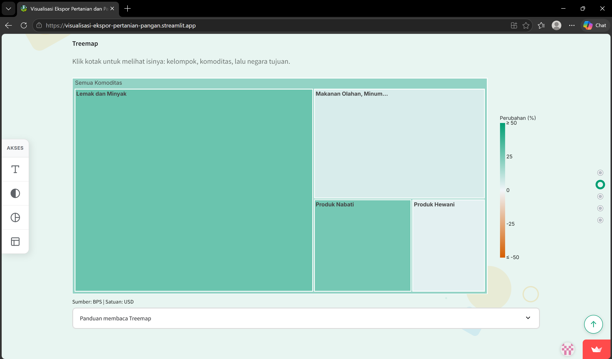
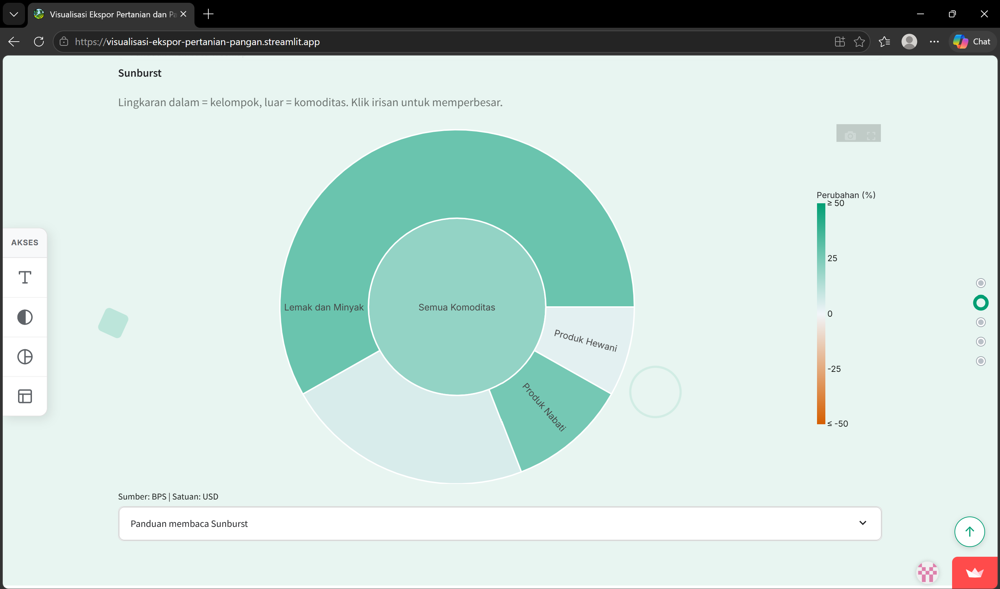
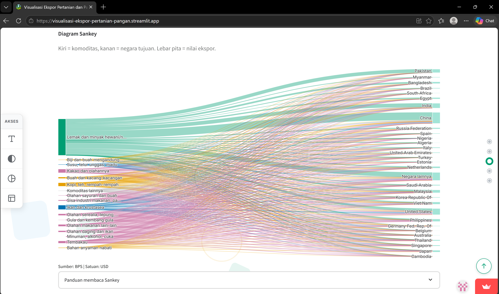
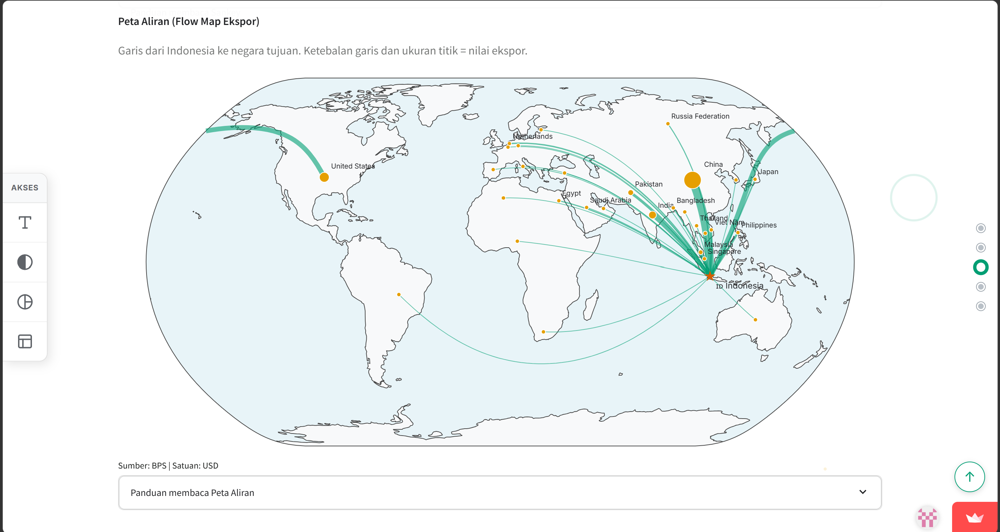
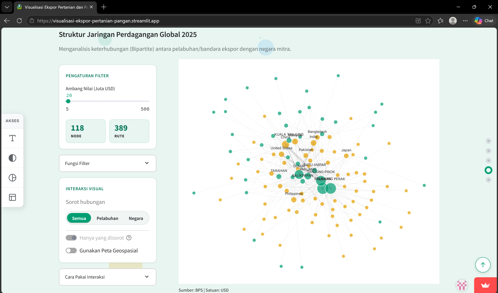
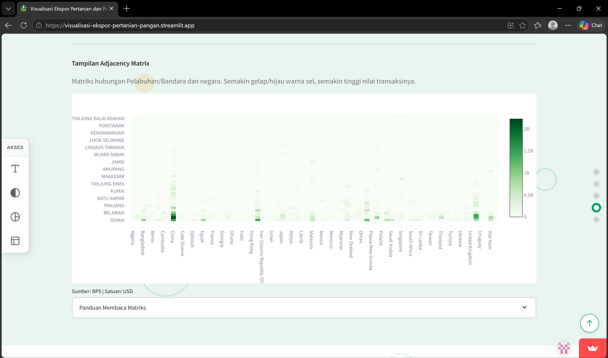

# Peta Ekspor Pertanian dan Pangan Indonesia

Visualisasi interaktif data ekspor sektor pertanian dan pangan Indonesia. Aplikasi ini dibuat sebagai pemenuhan tugas Ujian Akhir Semester mata kuliah Visualisasi Data dan Informasi di Politeknik Statistika STIS tahun 2026. Visualisasi memberi gambaran tentang struktur komoditas, arah aliran perdagangan, dan seberapa besar ketergantungan ekspor pangan Indonesia pada negara dan pelabuhan tertentu.

- **Website:** [Visualisasi Ekspor Pertanian dan Pangan Indonesia](https://visualisasi-ekspor-pertanian-pangan.streamlit.app/)
- **Repositori:** [sean-gusti/visualisasi-ekspor-pertanian-pangan](https://github.com/sean-gusti/visualisasi-ekspor-pertanian-pangan)

## Tangkapan Layar

### Title


### Hierarki
| Treemap | Sunburst |
|---|---|
|  |  |

### Aliran
| Sankey | Flow Map |
|---|---|
|  |  |

### Jaringan
| Graf Jaringan | Adjacency Matrix |
|---|---|
|  |  |

## Daftar Isi

- [Topik Visualisasi yang Dipenuhi](#topik-visualisasi-yang-dipenuhi)
- [Fitur Utama](#fitur-utama)
- [Fitur Pendukung](#fitur-pendukung)
- [Tangkapan Layar](#tangkapan-layar)
- [Teknologi](#teknologi)
- [Struktur Direktori](#struktur-direktori)
- [Cara Menjalankan Aplikasi Secara Lokal](#cara-menjalankan-aplikasi-secara-lokal)
- [Memproses Ulang Data](#memproses-ulang-data)
- [Tentang Data](#tentang-data)
- [Keterbatasan](#keterbatasan)
- [Penggunaan Alat AI](#penggunaan-alat-ai)
- [Kredit dan Lisensi](#kredit-dan-lisensi)

## Topik Visualisasi yang Dipenuhi

Proyek ini memenuhi tiga dari enam topik visualisasi data pada ketentuan tugas:

| Topik | Visual | Pemenuhan ketentuan minimal |
|---|---|---|
| Data berhierarki | Treemap, Sunburst | 3 level (kelompok, komoditas, negara), 2 representasi, ukuran mengkodekan nilai ekspor dan warna mengkodekan perubahan y-o-y, drill-down dengan penunjuk posisi |
| Data berjaring | Force-directed graph, Adjacency Matrix | Lebih dari 30 node berbobot, 2 tampilan, ukuran titik mengkodekan degree centrality, sorot tetangga dan filter ambang bobot edge |
| Data aliran | Sankey, Flow Map | Lebih dari 15 negara tujuan, 2 teknik, ketebalan mengkodekan volume, filter tahun dan jumlah negara tujuan |

Peta pada bagian Aliran dan Jaringan berfungsi sebagai pelengkap, bukan sebagai topik geospasial tersendiri.

## Fitur Utama

Visualisasi terdiri dari satu halaman yang dibagi menjadi empat bagian. Tiap bagian punya peran visual yang berbeda supaya tidak saling mengulang:

| Bagian | Pertanyaan yang dijawab | Visual |
|---|---|---|
| Ringkasan | Seberapa besar ekspor, dan bagaimana tren tahunannya? | Kartu metrik |
| Hierarki | Komoditas apa yang dominan, dan ke mana tiap komoditas dijual? | Treemap, Sunburst |
| Aliran | Bagaimana komoditas mengalir ke negara tujuan? | Sankey, Flow Map |
| Jaringan | Pelabuhan mana yang melayani negara mana? | Bipartite graph, Adjacency Matrix |

### 1. Ringkasan (Hero)
Menampilkan metrik utama: total nilai ekspor, komoditas penyumbang terbesar, jumlah negara tujuan, dan pertumbuhan year-on-year (y-o-y). Pengguna dapat memilih tahun data (2023, 2024, atau 2025). Karena data dimulai pada 2023, kartu pertumbuhan untuk 2023 menampilkan "Tahun dasar" (belum ada pembanding 2022).

### 2. Struktur Komoditas (Hierarki)
Treemap dan Sunburst membedah komposisi nilai ekspor dari kelompok komoditas, komoditas, hingga negara tujuan pembeli. Ukuran menunjukkan nilai ekspor, sedangkan warna menunjukkan persentase perubahan dibanding tahun sebelumnya. Pengaturan interaktif:
- menyembunyikan minyak sawit agar komoditas lain lebih terlihat;
- memilih jumlah negara tujuan per komoditas (5, 10, atau 20), sisanya digabung ke "Lainnya".

### 3. Aliran Perdagangan (Aliran)
- **Diagram Sankey:** aliran dari kelompok komoditas ke negara tujuan. Warna pita mengikuti kelompok komoditas.
- **Peta Aliran (Flow Map):** hubungan ekspor dari Indonesia ke tiap negara tujuan. Ketebalan garis dan ukuran titik sesuai nilai ekspor.

Pengguna dapat mengatur ambang persentase kontribusi komoditas dan membatasi jumlah negara tujuan teratas untuk mengurangi kepadatan visual.

### 4. Jaringan Pelabuhan/Bandara dan Negara Tujuan (Jaringan)
- **Force-Directed Bipartite Graph** antara pelabuhan/bandara ekspor dan negara mitra, yang dapat diproyeksikan ke peta geospasial. Ukuran titik menunjukkan degree centrality, yaitu banyaknya mitra yang terhubung.
- **Adjacency Matrix** pelabuhan × negara, dengan warna sel menunjukkan nilai ekspor.
- **Ambang nilai minimum** (juta USD) untuk menyaring rute kecil.
- **Sorot hubungan bertingkat:** pilih jenis (pelabuhan atau negara), lalu nama spesifik. Tampilan dapat dibatasi pada node terpilih beserta mitranya, atau menampilkan seluruh jaringan dengan jalur terpilih yang menyala.

## Fitur Pendukung

**Aksesibilitas dan keterbacaan**
- **Panel aksesibilitas:** panel di sisi kiri dengan empat tombol: perbesar teks, kontras tinggi, simulasi buta warna parsial, dan mode monokrom. Mode warna saling menggantikan, sedangkan perbesar teks bisa dipakai bersamaan. Di layar kecil, panel dapat dilipat lewat tombol panah.
- **Palet ramah buta warna:** warna kategori memakai palet Okabe-Ito.
- **Responsif:** tata letak menyesuaikan layar laptop maupun ponsel.
- **Hormati preferensi pengguna:** animasi latar dan petunjuk gulir dinonaktifkan untuk pengguna yang mengaktifkan pengaturan *reduced motion*.

**Navigasi**
- **Titik navigasi antarbagian** di sisi kanan, menandai bagian yang sedang dibaca dan dapat diklik untuk berpindah dengan gulir halus (disembunyikan di layar sangat kecil).
- **Tombol kembali ke atas** di pojok kanan bawah, muncul setelah pengguna meninggalkan bagian hero.
- **Petunjuk gulir** di bagian hero yang dapat diklik dan hilang otomatis setelah pengguna mulai menggulir.

**Tampilan**
- **Hero dengan gambar latar:** bagian pembuka layar penuh dengan foto latar, judul, dan pemilih tahun.
- **Layar pemuatan:** layar pembuka berlatar buram dengan animasi putar dan teks "Memuat Visualisasi Ekspor..." saat halaman pertama kali dibuka.
- **Animasi gulir:** judul, kartu, grafik, dan panel muncul dengan efek geser dan memudar saat masuk ke layar.
- **Latar geometris bergerak:** bentuk transparan (lingkaran, cincin, persegi, segitiga, grid titik) yang melayang pelan di belakang tiap bagian, tanpa menghalangi klik pada konten.

**Interaksi dan panduan**
- **Kontrol interaktif:** pemilih tahun, pilihan jumlah negara bergaya tombol segmen, filter ambang nilai, dan sorot hubungan pada graf jaringan.
- **Panduan dalam aplikasi:** panel lipat berisi cara membaca tiap grafik dan penjelasan fungsi filter, serta keterangan sumber dan satuan di bawah setiap grafik.
- **Tooltip** pada setiap grafik saat kursor diarahkan ke elemen.
- **Toolbar grafik (bawaan Plotly):** sebagian besar grafik dilengkapi toolbar di pojok kanan atas, berisi unduh PNG, pan, zoom in/out, autoscale, dan layar penuh. Isi toolbar dapat berbeda antar jenis grafik.

## Tangkapan Layar

| Hierarki | Aliran (Sankey) |
|---|---|
|  |  |

| Jaringan (graf) | Jaringan (matriks) |
|---|---|
|  |  |

## Teknologi

Python 3.13.5, [Streamlit](https://streamlit.io), [Plotly](https://plotly.com/python/), [NetworkX](https://networkx.org), pandas, dan Pillow. Dependensi lengkap beserta versinya ada di `requirements.txt`.

## Struktur Direktori

```text
.
├── .streamlit/             # Konfigurasi antarmuka Streamlit
├── assets/
|   ├── hero.jpg            # Gambar bagian atas visualisasi
│   └── favicon.jpg         # Gambar untuk tab
├── data/
│   ├── mapping/
│   │   └── hs_seksi.csv    # Pemetaan chapter HS ke seksi
│   ├── processed/          # CSV olahan akhir yang dibaca aplikasi
│   │   ├── chapter_negara_tahun.csv
│   │   ├── chapter_tahun.csv
│   │   ├── ekspor_hs2_detail.csv
│   │   ├── ekspor_hs2_tahun_negara_pelabuhan.csv
│   │   └── negara_tahun.csv
│   └── raw/                # Data mentah BPS (xlsx)
│       ├── Ekspor_HS_1-12.xlsx
│       └── Ekspor_HS_13-24.xlsx
├── docs/
│   └── screenshots/        # Tangkapan dan dokumentasi layar aplikasi
│       ├── adjacencymatrix.png
│       ├── flowmap.png
│       ├── hero.png
│       ├── network.png
│       ├── sankey.png
│       ├── sunburst.png
│       └── treemap.png
├── src/
│   ├── pipeline/
│   │   ├── 01_gabung_tidy.py   # Gabung data mentah menjadi format tidy
│   │   └── 02_turunan.py       # Tabel turunan dan y-o-y
│   ├── views/              # Perender tiap bagian visual
│   │   ├── aliran.py
│   │   ├── hierarki.py
│   │   └── jaringan.py
│   ├── data.py             # Pemuat data olahan dengan cache
│   └── style.py            # Tata letak, CSS, helper kontrol, dan fitur antarmuka
├── app.py                  # Skrip utama aplikasi
└── requirements.txt        # Daftar dependensi
```

## Cara Menjalankan Aplikasi Secara Lokal

Pastikan Python sudah terinstal, lalu:

1. Buat dan aktifkan virtual environment:

```bash
   python -m venv venv
   venv\Scripts\activate
```

2. Instal dependensi:

```bash
   pip install -r requirements.txt
```

3. Jalankan aplikasi:

```bash
   streamlit run app.py
```

Aplikasi dapat dibuka di `http://localhost:8501`.

## Memproses Ulang Data

Data olahan sudah tersedia di `data/processed/`, jadi langkah ini tidak wajib. Untuk membuatnya ulang dari data mentah:

1. Pastikan berkas berikut tersedia:
   - `data/raw/Ekspor_HS_1-12.xlsx` dan `data/raw/Ekspor_HS_13-24.xlsx` (data mentah BPS)
   - `data/mapping/hs_seksi.csv` (pemetaan chapter HS ke seksi dan nama chapter)
2. Dari **folder utama proyek** (path di skrip bersifat relatif), jalankan berurutan:

```bash
   python src/pipeline/01_gabung_tidy.py
   python src/pipeline/02_turunan.py
```

Ringkasan proses:

| Skrip | Proses | Keluaran |
|---|---|---|
| `01_gabung_tidy.py` | Membaca kedua berkas mentah, mengubah tabel lebar (negara dan pelabuhan di header) menjadi format tidy dengan grain chapter × tahun × bulan × negara × pelabuhan, membersihkan nama negara, menggabungkan pemetaan seksi, lalu memvalidasi (24 chapter, setiap chapter punya seksi, jumlah rincian dibandingkan dengan baris Total BPS) | `ekspor_hs2_detail.csv`, `ekspor_hs2_tahun_negara_pelabuhan.csv` |
| `02_turunan.py` | Membuat tabel turunan dari agregat tahunan beserta pertumbuhan y-o-y (%), lalu memvalidasi bahwa total tiap tabel sama dengan total agregat | `chapter_tahun.csv`, `chapter_negara_tahun.csv`, `negara_tahun.csv` |

Pertumbuhan y-o-y dihitung sebagai (nilai tahun ini − nilai tahun sebelumnya) / nilai tahun sebelumnya. Untuk tahun pertama (2023) dan nilai dasar nol, hasilnya dikosongkan (NaN).

## Tentang Data

- **Sumber:** Badan Pusat Statistik (BPS), tabel "Data Ekspor Nasional HS 2 Digit Per Bulan Tahun 2023, 2024, dan 2025".
- **Cakupan:** ekspor HS 2 digit chapter 01 sampai 24 untuk tahun 2023, 2024, dan 2025, menurut negara tujuan, pelabuhan, dan bulan. Satuan nilai: USD.
- **URL:** https://www.bps.go.id/id/exim
- **Tanggal akses:** 3 Oktober 2026.

Aplikasi membaca CSV olahan di `data/processed/` lewat `src/data.py`, yang memakai cache Streamlit agar pembacaan lebih efisien. Setiap visualisasi mencantumkan "Sumber: BPS" beserta satuannya. Data pendukung non-BPS yang dipakai hanyalah koordinat negara dan pelabuhan yang diisi manual untuk keperluan peta.

## Keterbatasan

- Analisis dilakukan pada tingkat chapter HS (2 digit), bukan komoditas rinci.
- Nama kelompok komoditas adalah ringkasan buatan penulis, bukan nama resmi BTKI.
- Data dimulai pada 2023, sehingga pertumbuhan y-o-y dan warna perubahan pada Hierarki tidak tersedia untuk 2023 (tahun dasar).
- Ambang nilai dan jumlah negara teratas memengaruhi isi visual pada bagian Aliran dan Jaringan. Negara di luar top-N digabung ke "Negara lainnya" dan tidak digambar pada Flow Map.
- Kolom pelabuhan pada data BPS mencampur pelabuhan laut dan bandara (bertanda "(U)"), dan keduanya diperlakukan sama.
- Koordinat pelabuhan pada mode peta diisi manual dan sebagian merupakan perkiraan. Pelabuhan tanpa koordinat tidak tampil di mode peta, tetapi tetap ada di mode graf.

## Penggunaan Alat AI

Asisten AI digunakan sebagai alat bantu untuk menulis dan men-debug kode, merapikan tampilan antarmuka, serta menyusun dokumentasi. Penulisan kode dibantu AI, penulisan dan pengambilan dokumentasi dan aset, pemilihan tema dan data BPS, rancangan visualisasi, serta interpretasi hasil ditentukan dan dipahami sendiri oleh penulis, yang bertanggung jawab penuh atas seluruh isi proyek.

## Kredit dan Lisensi

- Data: Badan Pusat Statistik (BPS).
- Gambar hero: [Pinterest](https://id.pinterest.com/pin/28217935160839328/). Hak cipta milik pemilik aslinya.
- Font: Inter (Google Fonts). Palet warna: Okabe-Ito.